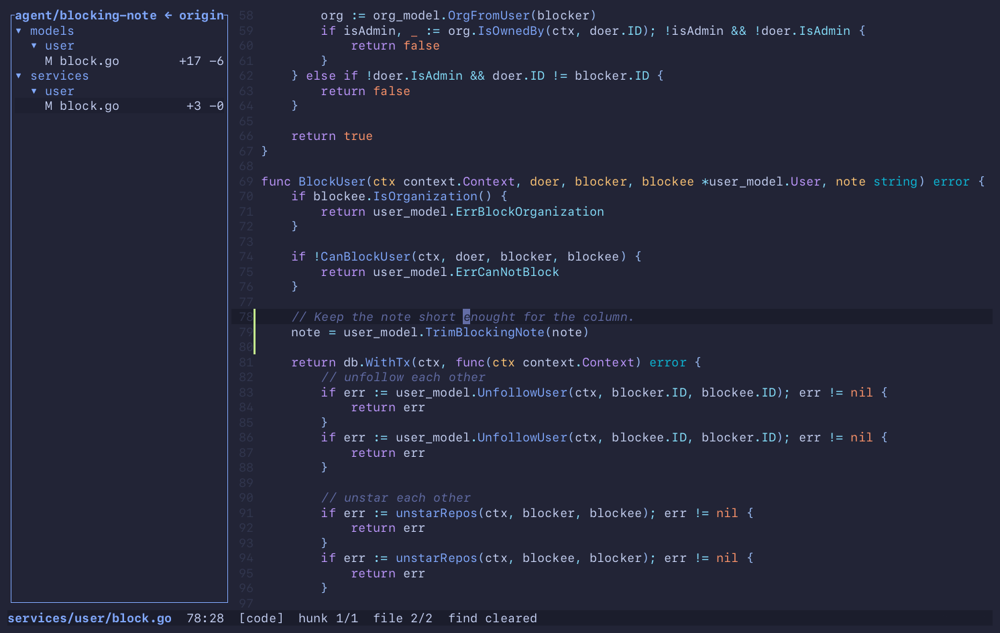

<p align="center">
  
</p>

<h1 align="center">merl</h1>

<p align="center"><b>The one editor you need when agents write the code.</b></p>

<p align="center">
  <a href="https://github.com/Maksim-Burtsev/merl/actions/workflows/ci.yml"></a>
  <a href="https://github.com/Maksim-Burtsev/merl/releases"></a>
  <a href="LICENSE"></a>
  <a href="https://doc.rust-lang.org/edition-guide/rust-2024/index.html"></a>
</p>

An agent works in one terminal split. merl sits in the other. You read what the agent wrote, walk
its branch hunk by hunk, jump from a changed line into the code around it, fix the one line that
is wrong, and go back to reading.

That is the whole tool: find your way around a project, review a diff with the code around it,
and now and then type a secret into a `.env`. No setup, no config, no modes. It runs wherever a
terminal does, SSH and tmux included.

<p align="center">
  
</p>

<p align="center"><sub>A checkout of <a href="https://github.com/go-gitea/gitea">gitea</a>, 5,500 files. Nothing was indexed or configured first.</sub></p>

## Install

```sh
brew install maksim-burtsev/tap/merl
```

Or take a prebuilt binary for macOS (arm64) or Linux (x86_64, arm64) from the
[releases](https://github.com/Maksim-Burtsev/merl/releases):

```sh
curl -fsSL https://github.com/Maksim-Burtsev/merl/releases/latest/download/merl-aarch64-apple-darwin.tar.gz | tar xz
sudo mv merl /usr/local/bin/
```

Or build it (Rust 1.85 or newer):

```sh
cargo install --git https://github.com/Maksim-Burtsev/merl
```

Then:

```
merl                 # the current directory
merl FILE:LINE       # what compilers, linters and grep print, pasted straight in
merl --review        # the branch you are on, as a diff over the real files
merl --tutor         # every key, hands on, in about ten minutes
```

## Why

Agents write almost all of my code now. What is left for me is knowing the code: how it is built,
where things live, what answers for what. That is what makes an architecture call a good one and
an estimate in a meeting an honest one. And every branch still needs a person to read it before
it merges.

I did that in VS Code for five years, and spent the first few filing it down. What survived was
a file tree, a file with syntax highlighting, go to definition, search and a list of symbols.
Everything else I switched off, and it kept coming back: a new panel, a chatbot button, a popup
in the middle of a search, an extension complaining about a linter.

Meanwhile the work moved into terminals, next to the agents, and every extra window is one more
thing to keep in my head. Vim and Helix already live there, but they want weeks of learning and
a config before they pay off. I needed to switch yesterday.

merl has no autocomplete, and I only noticed recently. A large part of every editor is there
for typing code, and I had stopped typing it.

So merl is a bicycle. Not a spaceship filed down to a bicycle.

## Two jobs, and a small third

**Find your way around.** Open any file by a few letters of its name. Search the project and see
the hits while you type. Go to a definition and the status line says how merl got there: through
an import, through the type of the receiver, or only by name. Ask for usages and the declaration
comes first and the tests last. It follows you out of the project into the standard library and
the installed dependencies. `[` always takes you back.

**Review a branch.** `merl --review` is the review page of GitHub or GitLab with one difference:
the diff is drawn over the real files. Added lines carry a green mark, deleted lines stand in
place as grey ghosts, and everything above works from any changed line. You see what a new call
calls and who else uses the function it changed without leaving the review, so a review takes
less attention. It stays open while the agent keeps working: new files appear in the panel, the
counts follow every save, commit and rebase, and your cursor stays where it was. Comments and
approvals stay in the browser.

<p align="center">
  
</p>

**Fix a line.** Enter, type, Esc. It is saved on its own. That covers a typo, a constant, and
the secret you would rather not paste into an agent. [More on editing](docs/editing.md).

## A day with merl

**1. The agent says the branch is done.** `merl --review` opens it on its first hunk. The panel
lists what the branch touched. `merl --review=feature-x` fetches and switches first, `--base
origin/dev` compares against another base.


**2. `c` walks the hunks**, through the file and on into the next one. `C` walks back. Images
and other binaries are skipped, and merl says how many.


**3. A hunk calls something you do not know.** `d` opens its definition, `u` lists who else
calls it.


**4. `[` goes back** to the hunk you left, however far you wandered.


**5. A typo.** Enter, fix it, Esc. It is on disk before you look up.



**6. The agent is still working** in the other split. The file it just wrote shows up in the
review on its own, and `c` will walk into it.


## What merl is not

- No plugins.
- No language server and no index. Nothing to install per language, nothing to wait for.
- No splits and no tabs. Your terminal has those.
- No mouse.
- No keymap to write. The keys are below and they stay.
- No autocomplete, no snippets, no refactoring. The agent types.

None of these is on a roadmap. If you live in Vim or Helix and like it there, you do not need
merl.

## Keys

Letters while you read, VS Code habits while you type, and the usual chords (Ctrl+E, Ctrl+F,
Ctrl+G, F12) in both. `?` shows all of this inside merl.

**Read and review**

| Key | Action |
|---|---|
| o / Ctrl+E | Open a file (fuzzy) |
| s | Search the project |
| d / F12 | Go to definition of the word under the cursor, or its implementations |
| u / Shift+F12 | Usages of the word under the cursor |
| D | Project symbols (fuzzy) |
| [ / ] | Back / forward in the jump history |
| c / C | Review: next / previous hunk, on to the next file |
| / / Ctrl+F | Find in the open file |
| n / N | Next / previous match |
| : / Ctrl+G | Go to line |

**Edit**

| Key | Action |
|---|---|
| Enter | Edit at the cursor (Esc returns to navigation) |
| Ctrl+S | Save now (edits are saved on their own after a pause) |
| Ctrl+R | Reload from disk, dropping unsaved edits |
| Ctrl+Z / Ctrl+Y | Undo / redo |
| Ctrl+C | Copy the selection, or the line, to the clipboard |
| Edit: Ctrl+X | Cut the selection, or the line |
| Edit: Alt+Backspace / Alt+Delete | Delete the word before / after the cursor |

**View**

| Key | Action |
|---|---|
| t | Show or hide the file tree |
| T | Pick a theme (live preview) |
| w | Wrap long lines, or cut them at the edge and scroll sideways |
| Tab | Switch focus between tree and code |
| Esc | Close an overlay, leave edit mode, or clear selection and find |
| ? | This help |
| q | Quit |

<details>
<summary><b>Moving, selecting, the tree and the pickers</b>: arrows, Shift, Alt, Home and End, as everywhere else</summary>

| Key | Action |
|---|---|
| Arrows | Move the cursor; Up / Down go by screen row |
| Shift+Up / Shift+Down | Extend the selection by a screen row |
| Shift+Left / Shift+Right | Extend the selection by a char |
| Alt+Left / Alt+Right | Move one word |
| Alt+Shift+Left / Right | Extend the selection by a word |
| Ctrl+Shift+Left / Right | Extend the selection to the start / end of the screen row, then of the line |
| v | Select the word, then the line, then the paragraph |
| Ctrl+D / Ctrl+U | Move half a screen down / up |
| { / } | Previous / next paragraph (blank line) |
| PgUp / PgDn | Move one screen |
| Home / End | Start / end of the screen row, then of the line |
| Ctrl+Home / Ctrl+End | Start / end of the file |
| Tree: Up / Down | Move |
| Tree: Enter | Open the file, or expand the directory |
| Tree: Left / Right | Collapse / expand |
| Picker: Up / Down, Ctrl+P / Ctrl+N | Move |
| Picker: Enter | Accept |
| Picker: Esc | Cancel |
| Picker: PgUp / PgDn | Move one page |
| Help: Up / Down | Scroll |

</details>

## Languages

There is no language server and no index. Every lookup is a regex over the project's files, run
through [ripgrep](https://github.com/BurntSushi/ripgrep)'s library crates, so a project works
the moment you open it and a file the agent wrote a second ago is already searchable.

`d` never jumps without saying how it found the target. `via import app/repos.py` and
`via self.repo: UserRepository` are proven. `by name, 2 declarations` is a picker with an honest
label. `u` lists every whole-word use: the declaration first, then the open file, then the rest
of the code nearest first, and tests, mocks and generated files last. `/` and `s` look for the
text as typed, with no regex mode, and an uppercase letter makes them case-sensitive.

| Language | `d` and `D` find | `d` leaves the project for |
|---|---|---|
| Python | functions, classes, module-level names, fields; the receiver's type is followed (`self.repo.save`) | the standard library and the `.venv` |
| TypeScript / JavaScript | functions, classes, interfaces, types, enums, `const`, methods, fields; the receiver's type is followed; `tsconfig` paths | `node_modules` |
| Go | functions, methods, types, `var` / `const`, struct fields; the receiver's type is followed | GOROOT and the modules in `go.mod` |
| Rust | `fn`, `struct`, `enum`, `trait`, `type`, `const`, `static`, `mod`, `macro_rules!` | the sysroot and the crates in `Cargo.lock` |
| Java, Kotlin | types, methods, fields, constructors, `fun`, `object`, `val` / `var`; they search each other | |
| Ruby | `def`, classes, modules, constants, `attr_accessor`, `alias` | |
| C / C++ | functions, prototypes, methods, types, `typedef`, `using`, `#define`, globals | the system headers |
| C# | types, records, delegates, namespaces, methods, properties, fields | |
| Swift | types, protocols, actors, extensions, `func`, `init`, `let` / `var`, enum cases | `.build/checkouts` |
| PHP | functions, classes, interfaces, traits, enums, constants, properties | Composer's `vendor/` |
| Lua | every function form, `local` | |
| Elixir | every `def` form, modules, protocols, struct fields, module attributes | |
| Zig | `fn`, `const`, `var`, and tests in `D` | the standard library |
| Shell | functions, assignments, `alias` | |
| SQL | everything `CREATE`d, CTEs | |
| Makefile | targets, variables | |
| Terraform | the block behind `var.x`, `module.x`, `local.x`, `data.T.N`, `T.N` | |
| Dockerfile | `FROM … AS` stages | |
| YAML | anchors, keys that open a block (compose services, CI jobs) | |

The first column is what `d` finds; `D` lists the functions and types among them. What each rule
reads, what it refuses to guess, and why: [docs/navigation.md](docs/navigation.md).

## Themes

`T` lists the themes and repaints merl in the one under the cursor as it moves. Enter keeps it,
Esc puts the old one back. The default is `tokyonight-moon`. They were picked to sit in for
hours: no neon, and light themes that look like paper.

[docs/themes.md](docs/themes.md) has a screenshot of each and how to add your own.

## Config

There is none to write. `T` remembers your theme in `~/.config/merl/config.toml`, and
`autosave_delay_ms` (1000) lives there too.

## Terminals

merl runs in any terminal, and the same keys work over SSH and in tmux. There is no Cmd chord,
because terminals keep Cmd for themselves, so copy is Ctrl+C and quit is `q`. Ghostty, kitty,
WezTerm, iTerm2, foot and agterm get the kitty keyboard protocol. Terminal.app works, but it sends
neither Shift+arrows nor Ctrl+Home and cannot copy.

Copy reaches the system clipboard through the terminal (OSC 52), and paste is the terminal's
own. In Ghostty one line makes Cmd+C and Cmd+X work too:
`keybind = performable:cmd+c=copy_to_clipboard:mixed`.

## Status

1.0 is next. I work in merl every day, on my own machine and over SSH. What is left before 1.0
is in the [milestone](https://github.com/Maksim-Burtsev/merl/milestone/1). Issues are
welcome. A pull request that adds one of the things [merl is not](#what-merl-is-not) will be
declined, kindly.

## License

MIT — see [LICENSE](LICENSE). The syntax definitions come from
[bat](https://github.com/sharkdp/bat) via [two-face](https://github.com/CosmicHorrorDev/two-face).
The ported themes keep their authors' licences, shipped next to them in `themes/` and listed in
[docs/themes.md](docs/themes.md#licences).
