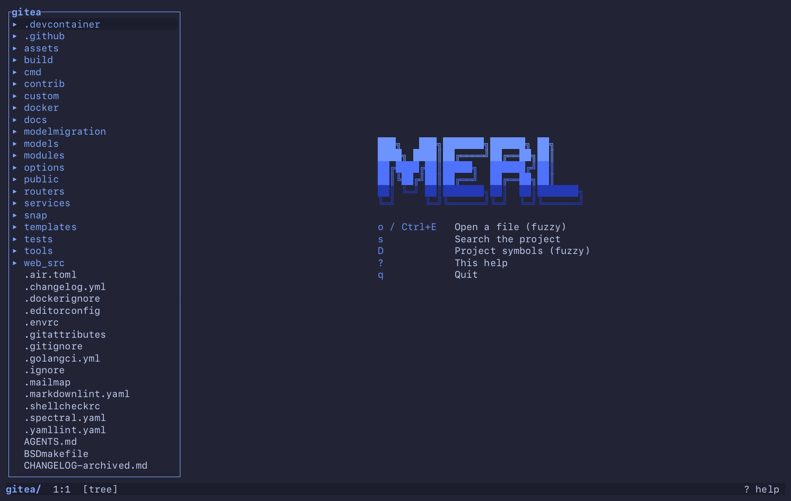

<p align="center">
  
</p>

<h1 align="center">merl</h1>

<p align="center">Code navigator for the terminal — VS Code's reading half, without the window.</p>

<p align="center">
  <a href="https://github.com/Maksim-Burtsev/merl/actions/workflows/ci.yml"></a>
  <a href="https://github.com/Maksim-Burtsev/merl/releases"></a>
  <a href="LICENSE"></a>
  <a href="https://doc.rust-lang.org/edition-guide/rust-2024/index.html"></a>
</p>

merl opens a codebase and gets you to the right line fast: fuzzy file open, project search,
go to definition and usages, all on VS Code-shaped keys. It is keyboard-only and
terminal-agnostic — no mouse, no Cmd — so the same bindings work over SSH, in tmux, and in
whatever terminal you happen to have. It is for reviewing code and walking a codebase in a
terminal split next to a coding agent, where you read far more than you type and the file under
you keeps changing. Today it only reads; editing is
[planned](https://github.com/Maksim-Burtsev/merl/issues/11).

## Demo

<p align="center">
  
</p>

The project is the one `merl --tutor` uses. The recording is scripted in [`assets/demo.tape`](assets/demo.tape)
for [vhs](https://github.com/charmbracelet/vhs), so it can be regenerated after a UI change.

## Install

Homebrew:

```sh
brew install maksim-burtsev/tap/merl
```

Prebuilt binaries for macOS (arm64) and Linux (x86_64, arm64) are attached to every
[release](https://github.com/Maksim-Burtsev/merl/releases):

```sh
curl -fsSL https://github.com/Maksim-Burtsev/merl/releases/latest/download/merl-aarch64-apple-darwin.tar.gz | tar xz
sudo mv merl /usr/local/bin/
```

From source (Rust 1.85 or newer, for the 2024 edition):

```sh
cargo install --git https://github.com/Maksim-Burtsev/merl
```

## Usage

```
merl                 # the current directory
merl DIR             # a project directory
merl FILE            # a single file
merl FILE:LINE       # a file, positioned at a line
merl --theme NAME    # override the configured theme
merl --tutor         # interactive tutorial, ~10 minutes
merl --version
```

`merl --tutor` walks through every navigation key on a small Python project bundled in the binary:
twenty-seven lessons, each one done when the key actually did what it says, on a copy in a temporary
directory that is removed when you quit.

The `FILE:LINE` form is what compilers, linters and grep already print, so a result can be pasted
straight in:

```sh
merl path/to/file.py:120
```

## Keys

| Key | Action |
|---|---|
| o / Ctrl+E | Open a file (fuzzy) |
| / / Ctrl+F | Find in the open file |
| n / N | Next / previous match |
| s | Search the project |
| d / F12 | Go to definition of the word under the cursor, or its implementations |
| D | Project symbols (fuzzy) |
| u / Shift+F12 | Usages of the word under the cursor |
| [ / ] | Back / forward in the jump history |
| c / C | Review: next / previous hunk, on to the next file |
| : / Ctrl+G | Go to line |
| t | Show or hide the file tree |
| T | Pick a theme (live preview) |
| w | Wrap long lines, or cut them at the edge and scroll sideways |
| Tab | Switch focus between tree and code |
| Enter | Edit at the cursor (Esc returns to navigation) |
| Ctrl+S | Save now (edits are saved on their own after a pause) |
| Ctrl+R | Reload from disk, dropping unsaved edits |
| Ctrl+Z / Ctrl+Y | Undo / redo |
| Ctrl+C | Copy the selection, or the line, to the clipboard |
| Edit: Ctrl+X | Cut the selection, or the line |
| Edit: Alt+Backspace / Alt+Delete | Delete the word before / after the cursor |
| Arrows | Move the cursor; Up / Down go by screen row |
| Shift+Up / Shift+Down | Extend the selection by a screen row |
| Shift+Left / Shift+Right | Extend the selection by a char |
| Alt+Left / Alt+Right | Move one word |
| Alt+Shift+Left / Right | Extend the selection by a word |
| Ctrl+Shift+Left / Right | Extend the selection to the start / end of the screen row, then of the line |
| v | Select the word, then the line, then the paragraph |
| Ctrl+D / Ctrl+U | Move half a screen down / up |
| { / } | Previous / next paragraph (blank line) |
| PgUp / PgDn | Move one screen |
| Home / End | Start / end of the screen row, then of the line |
| Ctrl+Home / Ctrl+End | Start / end of the file |
| Esc | Close an overlay, leave edit mode, or clear selection and find |
| ? | This help |
| q | Quit |
| Tree: Up / Down | Move |
| Tree: Enter | Open the file, or expand the directory |
| Tree: Left / Right | Collapse / expand |
| Picker: Up / Down, Ctrl+P / Ctrl+N | Move |
| Picker: Enter | Accept |
| Picker: Esc | Cancel |
| Picker: PgUp / PgDn | Move one page |
| Help: Up / Down | Scroll |

`?` shows the same table inside merl.

## Review

```sh
merl --review                    # the branch you are on, its first hunk
merl --review=feature-x          # fetch and switch to it first
merl --review --base origin/dev  # against a base other than origin/HEAD
```

The branch's diff is a lens over the real files, not a separate document: added lines carry a
green mark, deleted lines are drawn in place as grey ghosts, and `d`, `u` and `s` work straight
from the diff. The panel lists the branch's files with `M` / `A` / `D` and `+n −m`; `c` / `C` walk
the hunks and go on to the next file; `[` brings you back from wherever `u` took you. Files with
no lines to read (images and other binaries, marked `bin`, a mode change, a pure rename) are not
stops: `c` walks past them and says how many, and Enter in the panel still opens them. A deleted
file opens read-only from the base. Comments and approvals stay in the browser.

## Editing

Enter turns the cursor into a text cursor, Esc turns it back. In between, merl is a plain
editor with VS Code habits: letters insert, Enter splits the line and keeps its indentation, Tab
indents the way the file already does (tabs or four spaces, shown in the status bar), arrows and
Home / End move, Shift+arrows select. The letter commands are letters again once you press Esc;
the chord aliases (Ctrl+E, Ctrl+F, Ctrl+G, F12) work while editing. Find, go to line and a
cancelled prompt or picker bring you back to editing; an entry accepted in a picker ends it.

Typing over a selection replaces it, Backspace and Delete remove it. Alt+Backspace and Alt+Delete
(Option on a Mac) delete a word back and forward, here and in the prompts. Ctrl+C and Ctrl+X copy and
cut the selection (or the whole line without one) to the system clipboard through the terminal
(OSC 52: Ghostty, kitty, WezTerm, agterm, and iTerm2 once "Applications in terminal may access
clipboard" is on; Terminal.app cannot). Paste is the terminal's own Cmd+V; outside edit mode it
types into the `/`, `s` and `:` prompts and picker queries, and navigation ignores it. Ctrl+C
copies outside edit mode too and never quits: that is `q`.

The `/`, `s` and `:` prompts and picker queries are one-line editors with the same keys: arrows,
Alt+arrows by word, Home and End, Delete, Shift, Alt+Shift or Ctrl+Shift with an arrow to select, plus
the shell's Ctrl+A, Ctrl+E, Ctrl+W and Ctrl+U. Results follow every edit. While a find pattern
is active (until Esc clears it), `/` opens with it selected: type to replace it, press an arrow
or Home to edit it.

In a git repository the gutter shows what differs from the index, as VS Code's does: green for
added lines, blue for changed ones, red under a line where lines were deleted. The marks come
from `git diff` after every save and reload, so they trail an edit by the autosave delay.

Ctrl+Z and Ctrl+Y undo and redo, per file, for as long as it is open; a run of keystrokes on one
line is one step, as in VS Code. There is no save step: edits reach the disk `autosave_delay_ms` after the last keystroke, and
at once when you leave edit mode, switch files or quit. Ctrl+S saves now. A file that changes on
disk under unsaved edits is neither reloaded nor overwritten: the status bar says so, Ctrl+S keeps
your version and Ctrl+R takes the disk's — VS Code's conflict prompt, with keys. A file deleted or
renamed on disk is changed too: the autosave never puts it back, Ctrl+S does, and Ctrl+R lets the
edits go. Until then, or
while a save keeps failing, merl stays on the file: another one does not open, and `q` has to be
pressed twice to quit without the edits. Tabs, CRLF line endings and the trailing newline come back
out as they went in; binary files, non-UTF-8 files and files with mixed line endings stay
read-only, and so does a line too long to be shown whole.

## How navigation works

There is no language server and no index: every lookup is a regex over the files found at startup,
run through [ripgrep](https://github.com/BurntSushi/ripgrep)'s library crates. `d` knows the
declaration forms below and searches only where such a definition can live.

A word an import brings in, or the module in front of it, is looked for in the module the import
names. When that is the project's own code, only its file or package is searched, so a
same-named class in a test fake or another package is not a candidate. Python's
`from app.repos import UserRepo`, `import app.repos as r` and `from .repos import UserRepo` read
`app/repos.py` or `app/repos/__init__.py`, at the root, under `src/` or deeper, but not inside
another package. TypeScript's `./x` reads `x.ts`, `x.tsx`, `x.d.ts`, the JavaScript forms or
`x/index.*` (`./x.js` finds `x.ts` too), and an alias such as `@/x` goes through the `paths` and
`baseUrl` of the nearest `tsconfig.json` and the configs it extends. A named import finds that
name, aliased or not; a default import finds the declaration under its local name, or else the
module's `export default`; `ns.x` behind `import * as ns` finds `x`. A Go import path below the
`module` of a `go.mod` in the project is that package's directory. The word must be declared
directly in the module, or in the class the chain goes through (`UserRepo.create`), so `store.Open`
never lands on a method called `Open`. The status line names the file or the package:
`UserRepo: via import app/repos.py`, `Open: via import store/`. A module that does not declare the
word itself — an `__init__.py` or an `index.ts` that re-exports it — is not followed further: `d`
falls back to the search by name below and says `by name`.

An import of anything else is looked for outside the project first, even when the project declares
a word of the same name (Rust still looks in the project first). A word no import binds goes
outside only when the project has no definition of it. Outside means the standard library and the
installed dependencies the toolchain on this machine knows about — `sys.path` of
`.venv/bin/python` (or `python3`), `rustc --print sysroot` and the crates in `Cargo.lock`, `GOROOT`
and the modules in `go.mod`, `node_modules` — narrowed to the module the file's imports bind the
word to: `np.array` behind `import numpy as np` looks in `numpy`, `load` behind
`from json import load` in `json`, `Regex::new` behind `use regex::Regex` in the `regex` crate,
`chromium.launch()` behind `import { chromium } from 'playwright'` in that package; a bare
`std::fs::read_to_string` is its own path, and a relative import (`from . import views`,
`./utils`) is never looked for outside. A compiled module such as `orjson` lands in its `.pyi`
stub. The standard library's hits come before the dependencies', the picker shows paths relative
to their root, and files opened from there are read-only. Go's `_test.go` files, `testdata` and
nested modules such as GOROOT's `cmd` are skipped, since no import reaches them. C and C++ have no
per-project manifest — what the build system was told with `-I` is not in the source — so their
roots are the system headers: the SDK `xcrun` reports on a Mac, `/usr/include` on Linux, and
`/usr/local/include` and `/opt/homebrew/include`. `#include` binds no name of its own, so nothing
narrows the search — not even a `std::` qualifier, which names a namespace and no directory — and a
word the project does not declare is looked for in all of them. The C++ standard headers carry no
extension, so `<vector>` itself is not read; what its implementation puts in `.h` files is. Java, Kotlin,
Ruby and the rest have no roots yet, so `d` stays inside the project for them. A parameter has no
declaration the rules know, nor has an enum variant unless its class declares it as a field (a
Python `Enum` member, a TypeScript enum member with a value): `d` says so, and `u` lists every
whole-word use of the identifier. On `x.field` the word is a member: in Python, TypeScript and Go
the field of the type `x` is proven to have (below), else every method, property and field of
that name, found by name.

`d` never jumps without saying how it found the target. The status line reads
`delete_user → UserRepository.delete_user (by name, 1 match)` after a jump, `load: via import
json` or `UserRepo: via import app/repos.py` for a declaration an import leads to,
`delete_user → UserRepository.delete_user (via self.repo: UserRepository)` for one the type of the
receiver leads to, and `delete_user: by name, 2 declarations` over a picker, whose title says the
same. `by name` means a declaration pattern matched the word and nothing narrowed which
declaration it is, so a jump by name also says it was the only match. Each picker row starts with
what the declaration sits in and why it is listed —
`UserRepository.delete_user  by name  repos.py:8: async def delete_user(…)` — so typing a class
name filters the rows. A jump leaves the cursor on the name it landed on, so `d` there asks the
next question about it straight away.

What `d` does not claim, in Python, TypeScript and Go:
- On a declaration, the other declarations of the name are namesakes nothing ties to it. They
  are offered under `delete_user: at a declaration, 1 other by name`, even when there is one, so
  pressing `d` again after a proven jump never walks out of the type it has just proven. A field's
  declaration — `poster_id: int` in a class body, the `self.repo = repo` of `__init__`, a struct
  field — offers the other fields and members of its name the same way, on the name it declares
  only: the right-hand `repo` of `self.repo = repo` is the parameter, and the name of a Go embedded
  struct is its type's, where `d` goes.
- A parameter or a local hides an import of the same name: `json` in `def handler(json)` is a
  value, and `d` on the name itself lands on that binding, `helper → f.helper (local)`. In front of
  a dot it keeps the search to members: a function at the top of a module is not one.
- `Outer.find`, with `Outer` a namespace or a class, is what `Outer` declares (`via Outer`), not a
  method `find` of some other class.
- An imported name is looked up at the top of the module it comes from, outside the project as
  inside it, and a name imported from two modules (`try` / `except ImportError`) offers both.
- A line inside a triple-quoted string, a Go raw string, a template literal or a `/* */` block
  declares nothing.

On `x.word`, `x.f.word` and longer chains in Python, TypeScript and Go, `d` first looks for the
type of the receiver. `x` is `self` or `cls` in a method, `this` in a class, a Go method's
receiver, a parameter, a local or a module-level variable, and each name after it is a field of
the type before it. The type comes from the declaration:
- an annotation: `repo: UserRepository`, `private repo: UserRepository` (a constructor parameter
  too), a struct field `repo *UserRepository`, `var repo UserRepository`;
- a construction: `UserRepository()`, `new UserRepository()`, `UserRepository{}`,
  `&UserRepository{}`;
- a parameter handed on: `self.repo = repo`;
- a call, one hop through the return type the function declares: `-> UserRepository`,
  `): UserRepository`, `func NewRepo() *UserRepository` (a Go function's first result), or a
  function that declares none and whose every `return` constructs the same class,
  `return new UserRepository()` in TypeScript, `return UserRepository()` in an undecorated Python
  `def` (a bare `return` or a `yield` spoils it). A callee that a parameter or a local of the
  scope names is a value, not the function of that name. The function may be a method called on a receiver
  whose type is proven the same way, `info := e.RequestInfo()` or `repo = self.depot.people()`:
  the method is looked for in that type and the types it extends, where it must be declared once,
  an interface's method line included;
- a cast: `repo = cast(UserRepository, found)` (`typing.cast` too, the type quoted or not;
  a `cast` the project declares itself is a function, read by its return type),
  `const repo = found as UserRepository` (the last type of `as unknown as T`),
  `repo, ok := found.(*UserRepository)`, and the variable of a Go type switch,
  `switch v := found.(type)`, inside a `case *UserRepository:` (a `case` of several types and
  `default` leave it unknown). A chain may hang off the cast itself:
  `(found as UserRepository).deleteUser`, `found.(*UserRepository).DeleteUser`,
  `cast(UserRepository, found).delete_user`, `via found.(*UserRepository)`;
- a loop over a collection whose type is written: `for repo in repos` with
  `repos: list[UserRepository]` (`Sequence`, `Iterable`, `set`, `tuple[T, ...]` and the like),
  `for (const repo of repos)` with `UserRepository[]`, `Array<T>` or `Set<T>`,
  `for _, repo := range repos` with `[]*UserRepository`, `[4]T` or `map[K]T`. The collection is a
  plain name, and every declaration of it writes that type: as an annotation, as the declared
  return type of the function it was assigned from, or in Go as `make([]T, …)`, a literal `[]T{…}`
  or a named type declared `type RepoList []*UserRepository`. `repos.word` on the collection itself is no member of `UserRepository`, and a `dict`'s
  keys, a `Map`'s pairs, `for … in`, a tuple target, a single `range` variable and `async for`
  stay unknown;
- a property with a declared return type: `@property`, `@cached_property` or
  `@functools.cached_property` over `def users(self) -> UserRepository`, a getter
  `get users(): UserRepository`.

`T | None`, `Optional[T]`, `Annotated[T, …]`, `T | null` and generic arguments read as `T`.
The innermost scope that declares `x` decides: in Python the function the cursor is in (every
binding in it, before the cursor or after), else the nearest enclosing function that binds the
name, else the module; in TypeScript and Go the nearest block around the cursor with a declaration
above it, a function's parameters counting with its body. So a local hides a module-level name, a
closure's variable the one of the function around it, a block's the function's. The declarations
of that one scope must all read the same type, and one that reads none (a loop variable, a
parameter with no annotation) hides the outer ones all the same, so nothing is guessed: two
assignments in the branches of an `if` are a picker. In TypeScript and Go a header hides the
outer scopes only with what it binds for the block under it: the loop or the `catch` it is, the
function whose body it opens. The parameter of any other function on those lines,
`if (repos.some((repo: Repo) => …)) {` or `register((repo: Repo) => repo, {`, and of one on the
cursor's own line, counts and hides nothing, since the cursor stands outside it; and what the
`if` branch declares is nothing to its `else`. A line inside a docstring, a raw string or a
template declares nothing. The type must be declared once, in
the same file, the same Go package or the project module an import names. `d` then looks for the
member in that type, and in the classes it extends and the structs it embeds, and the status line
names the link: `via self.repo: UserRepository`, `via NewRepo() *UserRepository`,
`via makeAudit() returns new AuditLog()`. A member that is no method is a field, and `d` lands on
its declaration — a class-body `poster_id: int`, a constructor parameter
`private repo: UserRepository`, a struct field `PosterID int` or an embedded struct — in the type
or the nearest one it extends or embeds: `PosterID → Issue.PosterID (via issue: Issue)`. A field
that no type declares that way is declared by its first `self.repo = …` in the base-most class
that assigns it, so a later `self.repo = other`, in the class or a subclass, goes there too. A
`this.x = …` counts only where `this` is the class, not an object literal or a `function` inside a
method; a parameter behind a modifier only in a constructor; a line of a docstring never. On an
interface or a base class `d` lands on the declaration there; a second `d`, with the cursor on it,
lists what implements it.

`super().word` in a Python method and `super.word` in a TypeScript class are `self` / `this` with
the walk started one level up, so an override leads to what it overrides:
`store → Archive.store (via super of ColdArchive)`. Under several Python bases only what needs no
method resolution order is proven: the first base declaring the member itself, or every base
leading to the same declaration (`Generic[T]`, `Protocol`, `ABC` and `object` aside), at every
level the member is looked for. Bases that disagree, or one outside the project that may declare
the member first, leave the word to the search by name, and so do `super()` in a function inside
the method and a local assigned from `super.make()`, whose return type an override may narrow. Go has no `super`: its
`i.Base.Touch()` is a chain through the embedded struct.

A chain is followed the same way one field at a time, up to six names in front of the word: on
`self.uow.users.delete_user` the type of `self.uow`, then the field `users` in that type, then
`delete_user` in the type of `users`. A field may be declared in a class the type extends, or
promoted from a Go struct it embeds, and an embedded struct can be a link by its name
(`h.Deps.uow`). The status line lists the links:
`delete_user → UserRepository.delete_user (via self.uow: UnitOfWork → users: UserRepository)`.

A type declared outside the project or any link the rules cannot prove leaves the word to the
search by name below. With two or more names in front of the word the status line says where the
chain broke: `delete_user: by name, 2 declarations (chain broke at item)` when `item` is typed by a
generic parameter, at a property or a getter with no return type, or at the seventh name of a
longer chain. A chain may hang off the call that starts the expression, which is read as a call
assigned to a name would be: `make_uow().users.delete_user` is
`via make_uow() -> UnitOfWork → users: UserRepository`, and so are `pkg.New(x).Run`,
`new Depot().people` and `self.repos.users.get_one(id).name`. A call of a call,
`open_depot().people_repo().delete_user`, is not followed: it is a member of a value whose type is
not known.

When the type of `x` is not known, every method of that name is a candidate: Python `def` and
`async def` inside a class, TypeScript class and object-literal methods, properties holding a
function and bodiless signatures, Go `func (r *T) Name(`. They are collected from the project and
from the standard library and dependencies, where TypeScript is read from its `.d.ts` files only.
So is every field of that name in the project, one row per type, on the line a proven receiver
would land on: Python `name: T` or `name = …` in a class body and `self.name = …` in a method,
TypeScript members and constructor parameters behind a modifier and `this.name = …`, Go struct
fields and embedded structs. A local, the key of a dict or an object literal and a line of a `var`
block are no field, and a name several types declare, such as `id`, is a picker rather than a
jump. The field lines are searched apart from the methods, and when they fill the search the count
says `+` and a single candidate is offered rather than jumped to. Fields outside the project are
not collected: there a field name is every `name: string;` of every `.d.ts`. A project with no
such method or field has the word at its top level instead — `x` was a class or a
namespace — and the usual declarations answer. One candidate jumps; several open the picker, the
project's first. A bare `self.word` or `this.word` whose class, or a class it extends, cannot be
read gets the project's declarations of that name, fields included, and nothing outside the
project.

With the cursor on the declaration of a member — a `Protocol` method, an interface signature, a
method of an abstract or a plain base class — `d` offers what implements it instead, labelled `send:
implementations of Notifier.send, 3 declarations`. In Python and TypeScript that is the types that
name it: the subclasses, the classes and interfaces that `extends` or `implements` it, and the
subclasses of those, four levels down. A type counts only when its own header names one of them and
its file can see that name — it declares it, or an import binds it — and only when it declares the
member itself, so a class that inherits it is not listed. A Python `Protocol` and a Go interface
name nothing, so there the rule is structural, the way both languages mean it: every member of that
name taking the same number of parameters. Only the project is searched, since an interface is
opened to find what this project does with it. A TypeScript header wrapped over several lines is
read, as prettier writes `export class X` over `  extends Base` over `{`; a Python one, whose bases
stand under the `class` line, is not. Nothing implements the declaration — a method beside its Go
type, a class with no subclasses — and `d` goes on to the search by name below.

| File | What `d` recognises | Searched |
|---|---|---|
| Python | `def` and `async def`, `class`, module-level assignment (annotated or not); behind a dot, a field: `name: T` or `name = …` in a class body, `self.name = …` in a method | every `.py` file |
| Go | `func` with or without a receiver, `type`, `var`/`const`, `:=`; behind a dot, a struct field or an embedded struct | every `.go` file |
| TypeScript / JavaScript | `function`, `class`, `interface`, `type`, `enum`, `namespace`, `const`/`let`/`var` (so arrow functions assigned to a name), class and object-literal methods, properties holding a function, a method signature with a return type and no body (`find(id: string): User;` in an interface, an abstract class, an overload or a `.d.ts`), behind `export`/`default`/`declare`/`async` and the member modifiers; behind a dot, a field: a member `name: T;` or `name = …`, a constructor parameter behind a modifier, `this.name = …`. Destructuring and parameters have no rule. | every `.ts`, `.tsx`, `.js`, `.jsx` and friend: they search each other |
| Rust | `fn`, `struct`, `enum`, `union`, `trait`, `type`, `const`, `static`, `mod`, `macro_rules!`, `let`, behind any `pub(..)`/`async`/`unsafe`/`const`/`extern`/`default` prefix. `impl` blocks count as uses. | every `.rs` file |
| Java | `class`, `interface`, `enum`, `record`, `@interface`; a method, an abstract or interface method and a field, told from a call by the return type before the name — a primitive, or a name with a capital in it, as Java writes its types; a constructor, behind at least one modifier, since a bare `Name(x) {` is a call. Annotations and modifiers may stand in front of any of them. | every `.java`, `.kt` and `.kts` file: they search each other |
| Kotlin | `fun` (with the receiver of an extension function), `class`, `interface`, `object`, `enum class`, `typealias`, `val`/`var`, behind `private`/`open`/`data`/`sealed`/`suspend`/`override` and the rest | every `.java`, `.kt` and `.kts` file: they search each other |
| Ruby | `def`, `def self.name`, `class`, `module`, an assignment (a constant, an `@ivar`, a local), `attr_accessor`/`attr_reader`/`attr_writer`, `alias`/`alias_method`. A trailing `?` or `!` is not part of the word, so `d` on `empty?` finds `def empty?`. Rails-style DSL (`scope`, `has_many`) has no rule. | every `.rb`, `.rake`, `.gemspec`, `.podspec`, `.rbi`, `.ru` file and `Rakefile`, `Gemfile`, `Vagrantfile` and friends |
| C / C++ | a function, a prototype and an out-of-line method (`Type::name(`) in column zero, where the languages have no statements, so a call is never one — the return type may sit on the line above, as GNU style writes it; a method or a function indented, when its body opens on the line; `struct`, `class`, `union`, `enum`, `enum class`, `namespace`, behind a template head, a storage specifier and an attribute or export macro (`struct __attribute__ ((__packed__)) sdshdr8`, `class FMT_API name`), a template specialization included; `typedef` in every form, `using x =`, `#define` (function-like too), a global. A header's prototype is offered next to the definition, in the picker's usual order, by path. An enum constant has no rule — `NAME,` in an `enum` body and in an initializer list are the same line — nor has a field, a local, a template parameter or a member function only declared inside its class. | every `.c`, `.h`, `.cc`, `.cpp`, `.cxx`, `.hpp`, `.hh` and `.hxx` file: they search each other |
| Shell | `name()` and `function name`, an assignment behind `export`/`declare`/`local`/`readonly`/`typeset` (or bare, and `+=`), `alias` | every `.sh`, `.bash`, `.zsh`, `.ksh` and shell dotfile (`.bashrc`, `.zshrc`, `.profile` and friends) |
| SQL | `CREATE` of a table, view, index, function, procedure, trigger, type, schema, sequence, domain, extension, database, role or user, behind `OR REPLACE`, `TEMP`, `UNLOGGED`, `MATERIALIZED`, `UNIQUE` and `IF NOT EXISTS`, schema-qualified or quoted; a `WITH … AS (` common table expression. Keywords ignore case. Columns have no rule. | every `.sql`, `.psql`, `.pgsql`, `.mysql`, `.ddl` and `.dml` file |
| Makefile, `*.mk` | a target, also one of several before the colon; a variable | every Makefile |
| Terraform | the block behind `var.x`, `module.x`, `local.x`, `data.T.N`, `T.N`; a bare name, as in `.tfvars`, is any block with that label | `.tf` files in the same directory |
| Dockerfile | the `FROM … AS name` stage | the same file |
| YAML | the `&name` anchor, a key that opens a block (compose services, CI jobs) | the same file |

In Makefiles, Terraform, Dockerfiles and YAML a `-` is part of the word under the cursor, and `d`
in Terraform reads the whole dotted address, so it works from anywhere in `aws_s3_bucket.logs.id`.

`D` lists every declaration a single regex can recognise (`def class func function type fn struct
enum impl trait interface mod const static union macro_rules! namespace`, with
`export`/`pub`/`async`/`const`/`extern`/`declare` prefixes; `const` and `static` only unindented or
exported, since indented they are locals), plus shell functions (`name()`; the `function name` form
the single regex already finds), SQL `CREATE`d objects under the name as written (`public.orders`,
not CTEs), Makefile targets, Terraform blocks by address (`aws_s3_bucket.logs`, `data.T.N`,
`module.x`, `var.x`, `output.x`), Dockerfile stages and YAML anchors, each read only from its own
kind of file; recomputed on each press. Java, Kotlin, Ruby, C and C++ are read from rules of their
own instead of that regex — Java's types and its methods, told from a call by the return type before
the name; Kotlin's `fun` (past an extension's receiver), types, `object`, `typealias` and
`const val`; Ruby's methods, classes and modules, `def self.name` included; C and C++ functions,
methods, types, `typedef`s, `using` aliases and `#define`s — so none of them is listed twice or
under a modifier or a receiver. A C prototype is not listed, since every function of a header would
be there twice, and a `typedef struct x { … } y;` is listed once, under the `y` the project writes.
TypeScript's class methods, with neither a keyword nor a type in front, are not listed: the regex
cannot tell `name(` from a call. Neither are fields, a C global, a Ruby
constant, or the names a Ruby `attr_accessor` line declares, since one line can declare several.
Past 5,000 declarations the grep stops, so the list is only what it reached in file order: the
title counts those rows and says what they are (`Symbols (first 5232, type to search all)`), and
the query stops filtering them and greps the project for a declaration whose name it matches,
after a pause in the typing, the way `s` does. A name declared in a file the cut never reached is
found that way; the title then counts the answer (`Symbols (94 hits)`, `Symbols (5000+ hits)` for
one the cut caught too, `Symbols (…)` while the grep runs). What the query matches there is the
declared name as typed — not the path beside it, and not the picker's own pattern syntax, so
`^`, `!`, a space and an accent are characters to find. Under 5,000 the rows are the whole list and the query
filters them, as before.
Searches are smart-case — an all-lowercase query ignores case, one uppercase letter makes it
case-sensitive — and `/` and `s` look for the text as typed: `foo(` finds the calls and the
definition, `a.b` only `a.b`. There is no regex mode. `s` lists its hits while you type, the open
file's first; Up / Down pick one and Enter jumps to it.

The file list comes from one `.gitignore`-respecting walk at startup and is not refreshed, so
files created while merl is open show up after a restart. Dotfiles are part of it — `.github/`,
`.env`, `.dockerignore` — and only the `.git`, `.hg` and `.svn` stores are skipped. The open file
itself is watched and reloads on every change on disk, keeping the cursor, the scroll position and
the jump history.

## Themes

Themes ship inside the binary as TextMate `.tmTheme` files, and syntect paints the code with them
(syntax definitions come from [bat](https://github.com/sharkdp/bat)'s set, via `two-face`). They
were picked to sit in for hours: palettes designed as a whole, no neon, and light themes that look
like paper rather than an inverted dark one. The default is `tokyonight-moon`;
[docs/themes.md](docs/themes.md) shows every theme with a screenshot and where it was ported from,
and how to port another.

`T` lists them inside merl and repaints everything in the theme under the cursor as it moves:
Enter keeps it and writes it to the config file below, Esc puts the old one back. `merl --theme
NAME` overrides the config for one run; an unknown name exits with code 1 and lists the valid
ones.

Your own themes go in `~/.config/merl/themes/` as `NAME.tmTheme`, where `NAME` is what `T` and
`--theme` call them. They are listed after the built-ins, and a file named after a built-in
replaces it, so a shipped theme can be copied and edited. Any TextMate theme works — the ones
bat and Sublime Text use, or one made with [`tools/port-theme.sh`](tools/port-theme.sh). A broken
file is an error naming the path: at startup merl exits with code 1, and in `T` it says so and
keeps the theme you had.

The infrastructure half of a repository is highlighted too: Dockerfiles and `Containerfile` (with
`RUN` lines as shell), compose, Kubernetes and CI YAML, Makefiles, Terraform, nginx, `.env`, TOML,
INI and systemd units, `.dockerignore`, `CODEOWNERS`, Sorbet's `.rbi` files and `Dangerfile`. A
`.h` file is painted as C++ rather than as the Objective-C bat's syntax set gives it: the C++
grammar is the C one plus templates, classes and namespaces, so it reads a header of either
language. An Objective-C header pays for that — its `@interface` and `@property` go unscoped,
while its `.m` file keeps the Objective-C grammar. Helm
templates are read as plain YAML, so their `{{ }}` blocks are not highlighted as a template
language.

## Config

`~/.config/merl/config.toml`:

```toml
theme = "tokyonight-moon"
autosave_delay_ms = 1000
```

Themes of your own live next to it, in `~/.config/merl/themes/`.

## Terminals

merl runs in any terminal. Where the kitty keyboard protocol is offered (Ghostty, kitty, WezTerm,
iTerm2 3.5+, foot, agterm) it is used, which makes every modified key unambiguous; everywhere else
merl falls back to the legacy escape sequences. Known limits: Terminal.app on macOS sends neither
Shift+arrows nor Ctrl+Home, and F12 on Mac keyboards needs Fn — which is why `d` and `u` are the
primary keys and the function keys only aliases.

Cmd never reaches a terminal program on its own, so copy is Ctrl+C. Ghostty can hand Cmd+C over
when there is no mouse selection for it to copy, and merl then treats Cmd+C / Cmd+X as the Ctrl
chords. Cmd+V needs nothing: the terminal pastes. In `~/.config/ghostty/config`:

```
keybind = performable:cmd+c=copy_to_clipboard:mixed
```

## Why not vim / helix / micro

Those are editors: their reading features sit behind a modal editing model or a keymap of their
own that you have to learn first. merl is a reader with VS Code-shaped habits — arrows, Home/End,
Ctrl+E, F12 — and nothing new to memorise. If you already live in vim, you do not need this.

## Status

Early, a personal tool made public. Issues are welcome; pull requests may wait.

## License

MIT — see [LICENSE](LICENSE). The syntax definitions come from
[bat](https://github.com/sharkdp/bat) via [two-face](https://github.com/CosmicHorrorDev/two-face).
The ported themes keep their authors' licences, shipped next to them in `themes/` and listed in
[docs/themes.md](docs/themes.md#licences).
