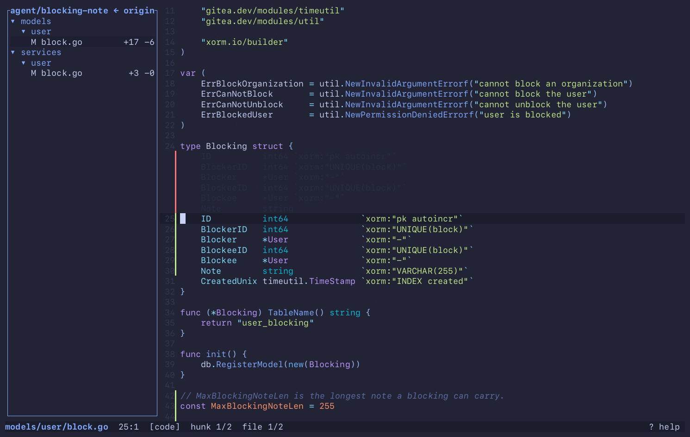

<p align="center">
  
</p>

<h1 align="center">merl</h1>

<p align="center"><b>The one editor you need when agents write the code.</b></p>

<p align="center">
  <a href="https://github.com/Maksim-Burtsev/merl/actions/workflows/ci.yml"></a>
  <a href="https://github.com/Maksim-Burtsev/merl/releases"></a>
  <a href="LICENSE"></a>
  <a href="https://doc.rust-lang.org/edition-guide/rust-2024/index.html"></a>
</p>

An agent works in one terminal split. merl sits in the other. You read what the agent wrote, walk
its branch hunk by hunk, jump from a changed line into the code around it, fix the one line that
is wrong, and go back to reading.

That is the whole tool: find your way around a project, review a diff with the code around it,
and now and then type a secret into a `.env`. No setup, no config, no modes. It runs wherever a
terminal does, SSH and tmux included.

<p align="center">
  
</p>

<p align="center"><sub>A checkout of <a href="https://github.com/go-gitea/gitea">gitea</a>, 5,500 files. Nothing was indexed or configured first.</sub></p>

## Install

```sh
brew install maksim-burtsev/tap/merl
```

Or take a prebuilt binary for macOS (arm64) or Linux (x86_64, arm64) from the
[releases](https://github.com/Maksim-Burtsev/merl/releases):

```sh
curl -fsSL https://github.com/Maksim-Burtsev/merl/releases/latest/download/merl-aarch64-apple-darwin.tar.gz | tar xz
sudo mv merl /usr/local/bin/
```

Or build it (Rust 1.85 or newer):

```sh
cargo install --git https://github.com/Maksim-Burtsev/merl
```

Then:

```
merl                 # the current directory
merl FILE:LINE       # what compilers, linters and grep print, pasted straight in
merl --review        # the branch you are on, as a diff over the real files
merl --tutor         # every key, hands on, in about ten minutes
```

## Why

Agents write most of the code now. Your part is to understand it and to review it, and merl does
those two things out of the box, with nothing to configure and nothing to switch off.

- **Understand the code.** Open a file by a few letters of its name, search the project as you
  type, go to a definition or list its usages, and come back with `[`. It follows you into the
  standard library and the dependencies.
- **Review a branch.** `merl --review` draws the branch's diff over the real files, so from any
  changed line you can look up what it calls and who else uses it. It stays current while the
  agent keeps working. [A review, step by step](docs/a-day-with-merl.md).

  

- **Touch up a line.** Enter, type, Esc. It saves itself. Enough for a typo, a constant, or a
  secret you would rather not hand to an agent. [More on editing](docs/editing.md).

I spent years switching things off in VS Code to get down to a tree, a highlighted file, go to
definition and search. Vim and Helix want weeks of learning and a config first. merl starts
there. It has no autocomplete, and it took me a while to notice: most of an editor is for typing
code, and I had stopped typing it.

## What merl is not

- No plugins.
- No language server and no index. Nothing to install per language, nothing to wait for.
- No splits and no tabs. Your terminal has those.
- No mouse.
- No keymap to write. The keys are below and they stay.
- No autocomplete, no snippets, no refactoring. The agent types.

None of these is on a roadmap. If you live in Vim or Helix and like it there, you do not need
merl.

## Keys

The dozen you will use every day. `?` inside merl shows the rest.

| Key | Action |
|---|---|
| o / Ctrl+E | Open a file (fuzzy) |
| s | Search the project |
| / / Ctrl+F | Find in the open file |
| d / F12 | Go to definition of the word under the cursor, or its implementations |
| u / Shift+F12 | Usages of the word under the cursor |
| D | Project symbols (fuzzy) |
| [ / ] | Back / forward in the jump history |
| c / C | Review: next / previous hunk, on to the next file |
| Alt+Left / Alt+Right | Move one word |
| Enter | Edit at the cursor (Esc returns to navigation) |
| t | Show or hide the file tree |
| ? | This help |
| q | Quit |

<details>
<summary>Every key</summary>

| Key | Action |
|---|---|
| o / Ctrl+E | Open a file (fuzzy) |
| / / Ctrl+F | Find in the open file |
| n / N | Next / previous match |
| s | Search the project |
| d / F12 | Go to definition of the word under the cursor, or its implementations |
| D | Project symbols (fuzzy) |
| u / Shift+F12 | Usages of the word under the cursor |
| [ / ] | Back / forward in the jump history |
| c / C | Review: next / previous hunk, on to the next file |
| : / Ctrl+G | Go to line |
| t | Show or hide the file tree |
| T | Pick a theme (live preview) |
| w | Wrap long lines, or cut them at the edge and scroll sideways |
| Tab | Switch focus between tree and code |
| Enter | Edit at the cursor (Esc returns to navigation) |
| Ctrl+S | Save now (edits are saved on their own after a pause) |
| Ctrl+R | Reload from disk, dropping unsaved edits |
| Ctrl+Z / Ctrl+Y | Undo / redo |
| Ctrl+C | Copy the selection, or the line, to the clipboard |
| Edit: Ctrl+X | Cut the selection, or the line |
| Edit: Alt+Backspace / Alt+Delete | Delete the word before / after the cursor |
| Arrows | Move the cursor; Up / Down go by screen row |
| Shift+Up / Shift+Down | Extend the selection by a screen row |
| Shift+Left / Shift+Right | Extend the selection by a char |
| Alt+Left / Alt+Right | Move one word |
| Alt+Shift+Left / Right | Extend the selection by a word |
| Ctrl+Shift+Left / Right | Extend the selection to the start / end of the screen row, then of the line |
| v | Select the word, then the line, then the paragraph |
| Ctrl+D / Ctrl+U | Move half a screen down / up |
| { / } | Previous / next paragraph (blank line) |
| PgUp / PgDn | Move one screen |
| Home / End | Start / end of the screen row, then of the line |
| Ctrl+Home / Ctrl+End | Start / end of the file |
| Esc | Close an overlay, leave edit mode, or clear selection and find |
| ? | This help |
| q | Quit |
| Tree: Up / Down | Move |
| Tree: Enter | Open the file, or expand the directory |
| Tree: Left / Right | Collapse / expand |
| Picker: Up / Down, Ctrl+P / Ctrl+N | Move |
| Picker: Enter | Accept |
| Picker: Esc | Cancel |
| Picker: PgUp / PgDn | Move one page |
| Help: Up / Down | Scroll |

</details>

## Languages

`d`, `u` and `D` work in all of these, with no language server and no index: a project works the
moment you open it. In Python, TypeScript and Go, `d` also follows the type of the receiver
(`self.repo.save`), and it always says how it found its target.

| Language | `d` also reaches |
|---|---|
| Python | the standard library and the `.venv` |
| TypeScript, JavaScript | `node_modules` |
| Go | GOROOT and the modules in `go.mod` |
| Rust | the sysroot and the crates in `Cargo.lock` |
| C, C++ | the system headers |
| Swift | `.build/checkouts` |
| PHP | Composer's `vendor/` |
| Zig | the standard library |
| Java, Kotlin, Ruby, C#, Lua, Elixir | |
| Shell, SQL, Makefile, Terraform, Dockerfile, YAML | |

What each rule reads and what it refuses to guess: [docs/navigation.md](docs/navigation.md).

## Themes

`T` lists the themes and repaints merl in the one under the cursor as it moves. Enter keeps it,
Esc puts the old one back. The default is `tokyonight-moon`. They were picked to sit in for
hours: no neon, and light themes that look like paper.

[docs/themes.md](docs/themes.md) has a screenshot of each and how to add your own.

## Config

There is none to write. `T` remembers your theme in `~/.config/merl/config.toml`, and
`autosave_delay_ms` (1000) lives there too.

## Terminals

Any terminal, and the same keys over SSH and in tmux. Terminals keep Cmd for themselves, so copy
is Ctrl+C and quit is `q`. Terminal.app is the weak one: no Shift+arrows, no Ctrl+Home, no copy.

In Ghostty, `keybind = performable:cmd+c=copy_to_clipboard:mixed` makes Cmd+C and Cmd+X work too.

## Status

I use merl every working day. 1.0 is next, and what is left for it is in the
[milestone](https://github.com/Maksim-Burtsev/merl/milestone/1). Issues are welcome.

## License

MIT. Syntax definitions come from [bat](https://github.com/sharkdp/bat) via
[two-face](https://github.com/CosmicHorrorDev/two-face); the themes keep
[their authors' licences](docs/themes.md#licences).
