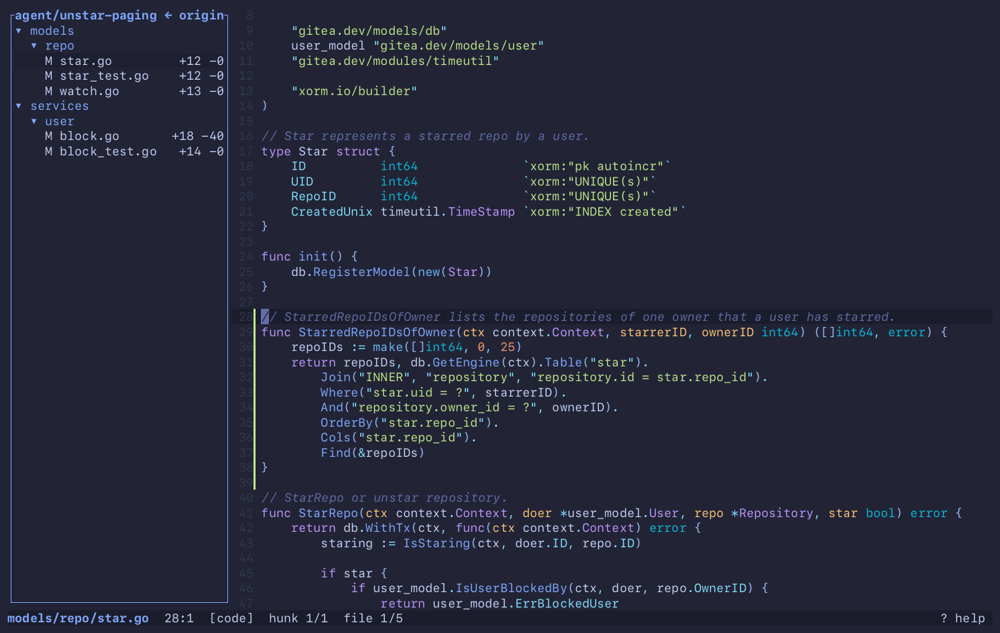
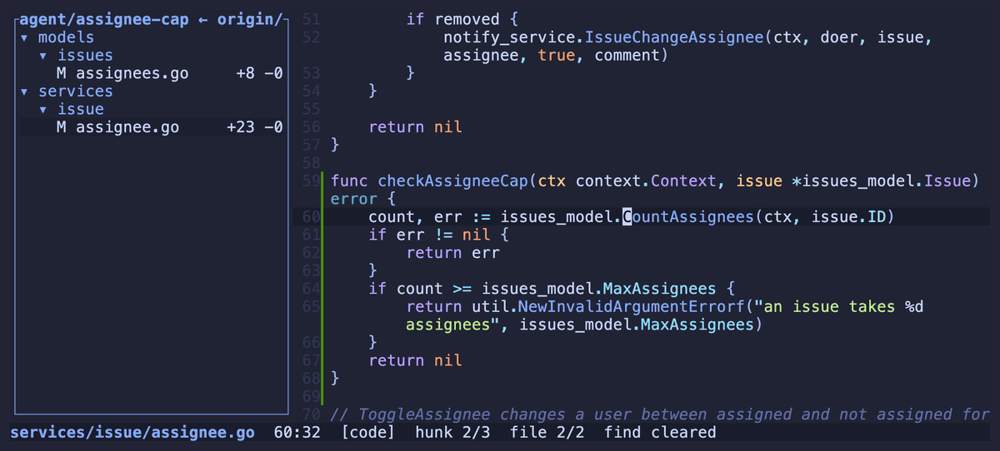
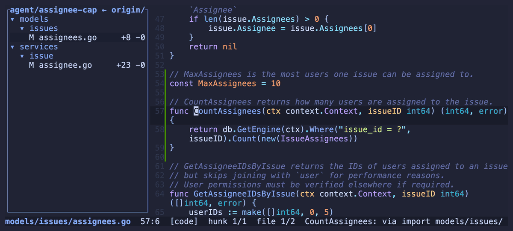
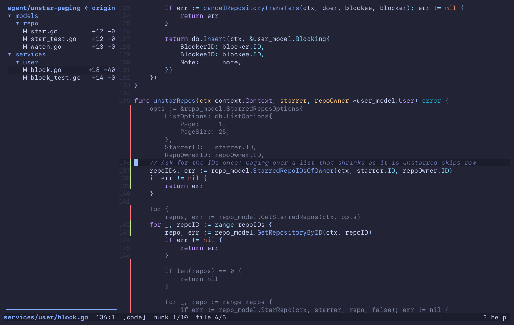

# A day with merl

One review, start to finish. The recordings are made by `assets/tapes/record.py` from the `.steps`
file next to each GIF.

**1. The agent says the branch is done.** `merl --review` opens it on its first hunk. The panel
lists what the branch touched. `merl --review=feature-x` fetches and switches first, `--base
origin/dev` compares against another base.

**2. `c` walks the hunks**, through the file and on into the next one. `C` walks back. Images
and other binaries are skipped, and merl says how many.

**3. A hunk calls something you do not know.** `Alt+Left` / `Alt+Right` hop word by word onto it,
`d` opens its definition, `u` lists who else calls it.

**4. `[` goes back** to the hunk you left, however far you wandered: one `[` per jump.

**5. The agent is still working** in the other split. The file it just wrote shows up in the
review on its own, and `c` will walk into it.

Nothing here types into the branch: a review is reading, and a fix typed over it reaches no pull
request. When the line is yours to change, Enter and Esc are in [Editing](editing.md).

